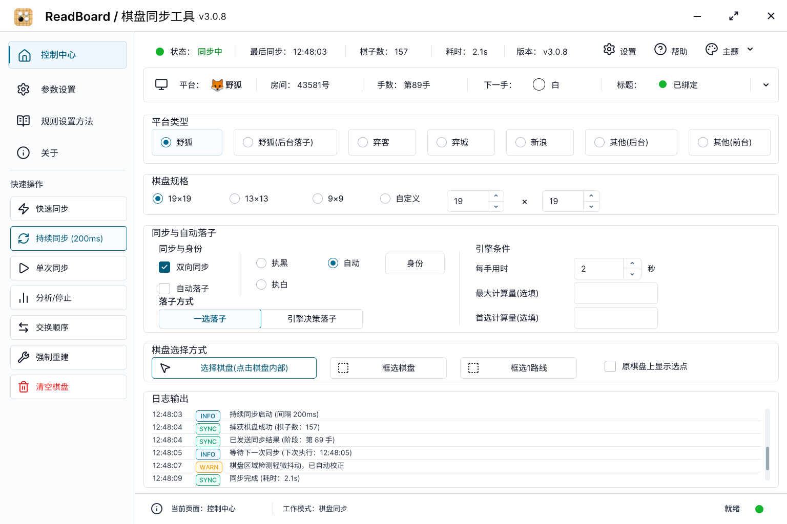
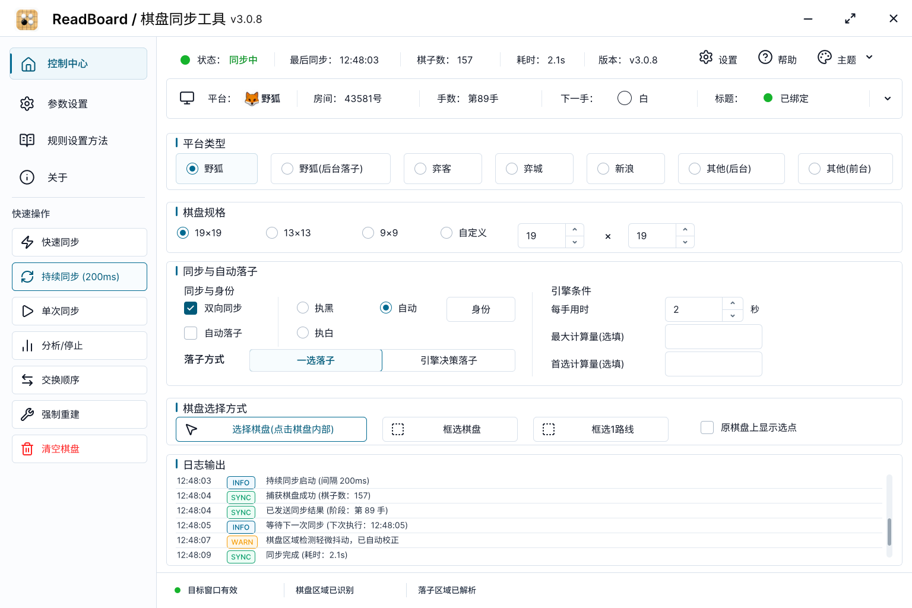
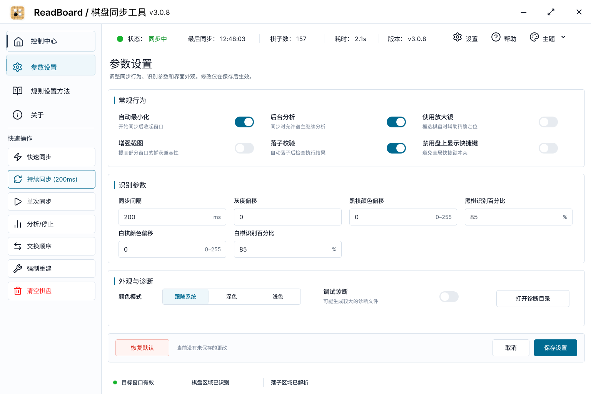
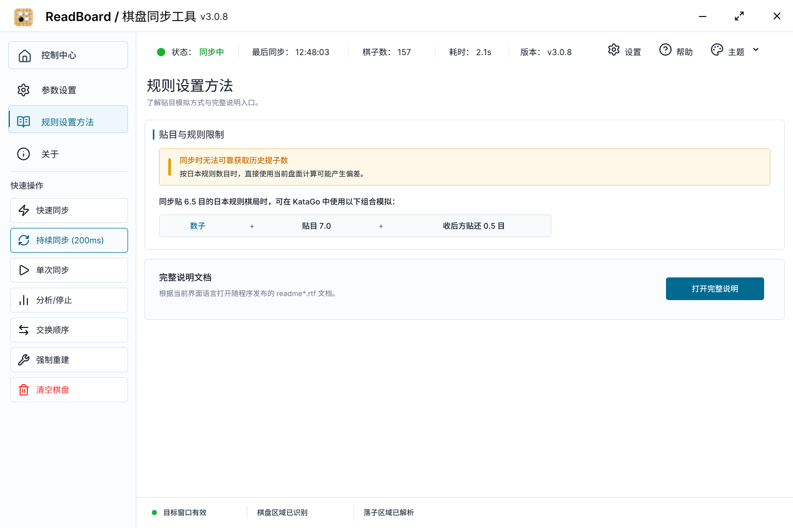
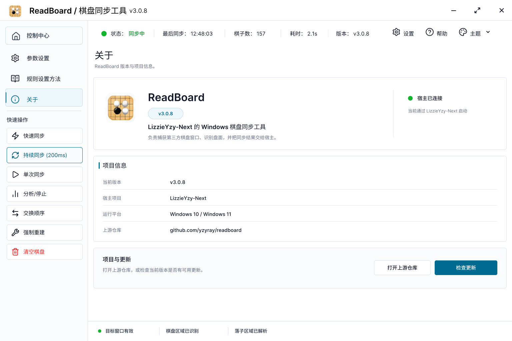
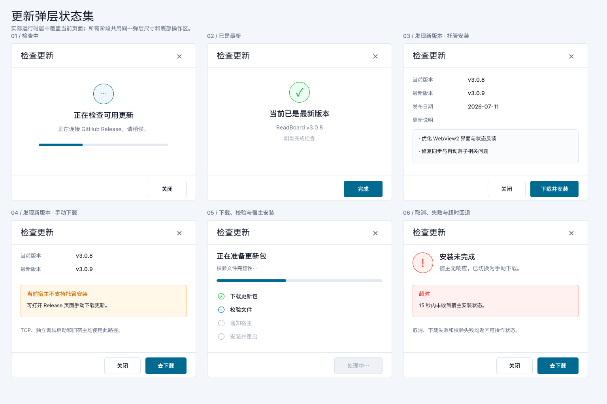
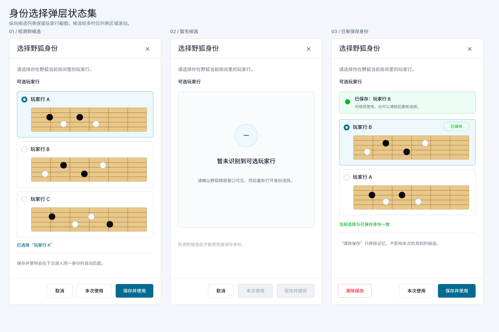

# ReadBoard WebView2 UI 重构设计

日期：2026-07-08

## 背景

ReadBoard 仍是 LizzieYzy-Next 调用的 Windows 棋盘同步工具。它负责截图、识别棋盘、同步棋盘状态，并通过旧文本协议把结果发给宿主；LizzieYzy-Next 负责引擎加载、棋盘显示、选点、胜率和分析。

本次用户确认的方向是全面改成 WebView2 UI，并且不再沿用旧 WinForms 视觉。参考界面是一个现代桌面工具面板：左侧导航、顶部状态、分组表单、底部日志输出；不显示棋盘、不显示胜率、不做引擎分析面板。`引擎条件` 区域保留参数输入，但去掉右侧“引擎决策落子时生效”提示。

## 已核对的现有约束

- `docs/DEVELOPMENT.md`: ReadBoard 是 LizzieYzy-Next 外接程序；启动参数、协议、发布结构变更必须检查宿主。
- `docs/specs/2026-04-21-mainform-theme-startup-parity-design.md`: 旧目标是统一到历史 WinForms 主题。本次用户明确要求全新 WebView2 视觉，因此该视觉目标被本设计覆盖。
- `docs/specs/2026-04-21-readboard-legacy-desktop-layout-design.md`: 旧目标是恢复 WinForms 桌面布局。本次不继续以旧 WinForms 布局为最终目标。
- `docs/specs/2026-04-23-mainform-state-boundaries.md`: `AppConfig` 是持久配置快照，不是所有 UI 编辑中间态的实时唯一来源。
- `docs/specs/2026-04-23-sync-session-state-locking.md`: `SyncSessionCoordinator` 的状态锁约定不因 UI 重构改变。
- `docs/specs/2026-04-23-protocol-keyword-constants.md`: wire 文本是公共合约；新增或改变协议必须同步测试和宿主解析。
- `docs/specs/2026-04-22-dotnet10-upgrade-design.md`: 旧 non-goal 写过“不迁移到 WPF/MAUI/Blazor”，未禁止 WebView2；“不改变与 LizzieYzy-Next 的通信协议”仍保留。
- `docs/specs/2026-05-04-board-debug-diagnostics-writer.md`: 调试诊断写盘是异步文件诊断，不应被 UI 日志面板改成同步热路径。
- `docs/specs/2026-05-01-readboard-hosted-auto-update-design.md`: 更新流程和宿主托管安装协议保持不变。
- `docs/specs/2026-05-20-fox-auto-play-color-detection-design.md`、`2026-06-24-gma-engine-decision-autoplay-design.md`、`2026-06-26-last-move-source-gma-turn-trust-design.md`: 自动落子和 GMA 是授权/参数/协议行为，不是 ReadBoard 内部引擎面板。

## 目标

- 用 WebView2 替换主窗口和用户可见对话框的视觉层。
- 保留现有 C# 核心：启动、配置、截图、识别、同步状态机、协议、自动落子、更新、诊断写盘。
- 保持 LizzieYzy-Next 启动方式和旧文本协议兼容。
- 主界面只展示同步工具需要的信息：宿主状态、平台/房间/手数、平台类型、棋盘规格、同步与自动落子、棋盘选择、日志输出。
- 底部新增紧凑 `日志输出`，显示最近运行事件，不替代调试诊断文件。
- 最终发布包不暴露旧 WinForms 样式作为用户可见 UI。

## 非目标

- 不在 ReadBoard 显示棋盘、胜率、候选点列表、PV 或引擎分析图。
- 不让 ReadBoard 启动或控制 KataGo。
- 不改变 `readboard.exe yzy <aiTime> <playouts> <firstPolicy> <transport> <language> <tcpPort>` 启动参数。
- 不改变现有 wire 文本，除非后续实现发现必须新增协议并另写规格。
- 不引入 Electron。
- 第一版不引入 React/Vite/前端构建链；静态 HTML/CSS/JS 足够覆盖这个工具面板。若后续 UI 状态复杂到静态脚本难维护，再单独评估。

## UI 结构

主窗口使用一个 WebView2 页面：

- 顶部：`ReadBoard / 棋盘同步工具`、版本、连接/同步状态、最后同步时间、棋子数、耗时，以及等距的设置/帮助/主题入口。检查更新只保留在关于页内容区。
- 状态条：平台、房间或标题上下文、手数、下一手、标题绑定状态。
- 左侧导航：控制中心、参数设置、规则说明、关于；快速操作包括快速同步、持续同步、单次同步、分析/停止、交换顺序、强制重建、清空棋盘。
- 主区域：
  - `平台类型`: 野狐、野狐(后台落子)、弈客、弈城、新浪、其他(后台)、其他(前台)。
  - `棋盘规格`: 19x19、13x13、9x9、自定义宽高。
  - `同步与自动落子`: 双向同步、自动落子、执黑/执白/自动、身份按钮、落子方式。
  - `引擎条件`: 每手用时、最大计算量、首选计算量。标题右侧不显示额外说明胶囊。
  - `棋盘选择方式`: 点击棋盘内部、框选棋盘、框选 1 路线、原棋盘上显示选点。
  - `日志输出`: 4-6 行默认可见，保留最近事件，可滚动。

设置、规则说明、关于使用同一个 WebView2 主壳页面；更新、野狐身份选择使用居中 WebView2 弹层。恢复默认确认、调试诊断警告、主题重启提示等辅助反馈复用同一弹层骨架。所有页面和弹层完成后统一切换，最终 release 不混用旧 WinForms 对话框视觉。

## 即时设计稿

即时设计保留两个画板版本：

- `ReadBoard / 控制中心 v1 / 历史保留版`：保留已确认的顶部工具栏间距与原分组布局。
- `ReadBoard / 控制中心 v2 / 已确认实现基准`：在 v1 基础上统一分类标题，并优化“同步与自动落子”布局；后续 WebView2 UI 实现以此版本为视觉基准。
- `ReadBoard / 参数设置 v1`：常规行为、识别参数、外观与诊断三个分组，以及固定页面操作栏。
- `ReadBoard / 规则说明 v1`：贴目与规则限制摘要和完整外部说明入口。
- `ReadBoard / 关于 v1`：产品、版本、宿主关系、上游仓库和更新入口。
- `ReadBoard / 更新弹层状态集 v1`：检查、最新、自动安装、手动下载、安装进度和失败回退六类代表状态。
- `ReadBoard / 身份选择弹层状态集 v1`：检测到候选、暂无候选和已有保存身份三类代表状态。















设计稿以用户提供的 `1536 x 1024` 参考图为唯一视觉基准，已按同尺寸导出并并排检查。主界面保持桌面工具密度，不采用大卡片、营销页留白或移动端式纵向堆叠。

关键尺寸：

- 窗口画板：`1536 x 1024`。
- 标题栏：基准高度 `48px`；应用图标 `28px`；主标题 `18px`；版本号 `13px`；最小化、最大化和关闭按钮均为 `48 x 48px`，窗口控制图标约 `16px`。
- 左侧导航：`264px`。
- 左侧导航项和快捷操作：基准高度约 `42px`、间距 `6px`、图标约 `18px`、文字约 `14px`；分隔线、分组标题和上下内边距采用紧凑间距，保证 4 个导航项与 7 个快捷操作同时可见。
- 底部状态栏：`60px`。
- 顶部运行状态栏和平台上下文状态条：基准高度均约 `44px`。
- 主内容区左右内边距：`16px`。
- 主内容分组间距约 `8px`，常规控件高度约 `36px` 到 `40px`。平台类型、棋盘规格、同步与自动落子、引擎条件、棋盘选择方式和至少 4 行日志在基准客户区内同时可见。
- 分组边框圆角：`6px`。
- 导航和操作按钮高度：`48px` 到 `54px`。
- 分类标题统一使用左侧 `3px` 强调线与 `12px` 标题缩进，不再紧贴分组上边框。
- “同步与自动落子”左栏采用两行同步/身份控件和单行落子方式，右栏三项引擎条件共用一致的行距与输入框基线。

四张新版主页面共用三个底栏状态，文字使用 `Inter Medium 14px` 和 `#263244`：

- 目标窗口：`目标窗口有效` / `等待选择目标窗口` / `目标窗口已失效，请重新选择`。
- 棋盘区域：`棋盘区域已识别` / `等待首次棋盘识别`。
- 落子区域：`落子区域已解析` / `落子区域暂不可用`。

这些状态只表达当前可验证能力，不承诺目标窗口永久有效或落子一定成功。

### 参数设置

- 设置修改先进入页面草稿；`保存设置` 统一校验并写盘，`取消` 丢弃全部草稿。
- `恢复默认` 只把草稿恢复为默认值，不立即写盘或退出；仍需用户保存。
- 常规行为保留自动最小化、后台分析、放大镜、增强截图、落子校验和禁用盘上显示快捷键。
- 识别参数保留同步间隔、灰度偏移、黑白棋颜色偏移和识别百分比；整数和范围错误在对应输入框附近显示。
- 外观与诊断保留系统/深色/浅色、调试诊断开关和打开诊断目录；颜色模式变化保存后显示重启提示。

### 规则说明与关于

- 规则页只显示现有 6.5 目模拟说明和规则限制摘要，不复制或改写庞大的 RTF 手册。
- `打开完整说明` 根据当前语言继续打开随程序发布的 `readme*.rtf`。
- 关于页只使用仓库可确认的信息：`ReadBoard`、当前版本、LizzieYzy-Next 宿主关系、Windows 10/11 和上游仓库。
- 关于页的外部仓库与检查更新操作仍经 C# 命令处理，WebView 不直接导航。

### 更新弹层状态

| 状态 | 主内容 | 可用操作 |
| --- | --- | --- |
| 检查中 | 不确定进度条和检查提示 | 关闭 |
| 已是最新 | 当前版本和完成时间 | 完成 |
| 可自动安装 | 当前/最新版本、日期、release notes | 关闭、下载并安装 |
| 仅手动下载 | 宿主能力提示和兼容说明 | 关闭、去下载 |
| 下载/校验/等待宿主/安装 | 同一进度骨架切换当前步骤，不伪造百分比 | `处理中…` 显示为禁用按钮，不可重复提交 |
| 取消/失败/超时 | 单行可清理错误和手动下载回退 | 关闭、去下载 |

### 身份选择弹层状态

- 候选采用纵向列表，每行包含单选、玩家行名称和宽幅截图；候选较多时只滚动列表区域。
- 未选择候选时禁用 `本次使用` 和 `保存并使用`；不再用额外 MessageBox 提示。
- 暂无候选时显示空状态，保留 `取消`，同时显示禁用的 `本次使用` 和 `保存并使用`；不新增当前实现没有的刷新命令。
- 已有保存身份时标记对应候选，并提供 `清除保存`；清除只移除记忆，不删除本次候选。

### 辅助弹层

- `恢复默认`：确认后只修改设置草稿。
- `调试诊断警告`：首次打开诊断开关时说明可能产生较大文件，确认后保留草稿状态。
- `主题重启提示`：设置保存成功且颜色模式变化后显示。
- `原棋盘上显示选点说明`：首次启用且 `ShowInBoardHint` 为 `true` 时显示现有前台同步限制和双向同步恢复说明；`确定` 只关闭弹层，`不再提示` 将 `ShowInBoardHint` 持久化为 `false`。迁移后不再打开旧 `TipsForm`。
- 这些反馈沿用更新弹层的标题、正文和固定底部按钮结构，不再使用旧 WinForms MessageBox 视觉。

关键视觉 token：

- 主文字：`#111827`。
- 主强调色：`#006A91`。
- 选中浅底：`#EEF7FB`。
- 普通边框：`#D8E1EB`。
- 分隔线：`#E3E9F0`。
- 同步成功：`#16B32C`。
- 危险操作：`#FF2424`。
- WebView 字体栈：`Inter, Segoe UI Variable, Segoe UI, Microsoft YaHei UI, sans-serif`。发布资源内置底栏所需的 `Inter Medium`，避免依赖用户机器已安装字体；中文继续回退到系统中文字体。

第一版需要实现的可见状态：

- 左侧当前导航项和当前运行操作的选中态。
- 单选、复选、数字微调输入和分段选择。
- 同步中、已绑定、就绪等状态点。
- `INFO`、`SYNC`、`WARN` 日志标签。
- 按钮禁用、悬停、按下和键盘焦点态，但不能改变布局尺寸。

## 架构

保留 WinForms 作为进程入口和 WebView2 宿主：

- `Program.cs` 仍解析宿主启动参数、创建 transport、初始化配置和语言。
- `MainFormRuntimeComposer` 仍装配同步运行时依赖。
- 新主窗体只承载 WebView2、窗口生命周期和 C# / JS 桥接。
- `Core` 下的同步、协议、截图、识别、自动落子、落子执行和诊断写盘不迁移到 JavaScript。

主窗口使用可缩放、可最大化的自定义标题栏。`1100 x 680` 是基准客户区尺寸，正常拖拽缩小时允许统一缩放至最低客户区 `960 x 600`，对应缩放下限约为基准尺寸的 `87%`；到达该下限后不再允许继续缩小。

本文中的 `1100 x 680` 和 `960 x 600` 均指 Windows DPI 处理后的有效逻辑客户区尺寸（DIP / CSS 像素），不是显示面板的原始物理像素。`960 x 600` 和约 `87%` 是硬性可用性下限，用户不能把窗口拖到更小，页面也不能继续缩小控件。普通按钮、开关等有效点击区域不得小于 `32 x 32px`，窗口控制按钮缩放后不得小于约 `42 x 42px`。

当前屏幕工作区本身小于 `960 x 600` 时进入紧急适配：保持最小控件尺寸以保证功能可点击，允许主内容区滚动兜底；工作区宽度也不足时可以出现横向滚动。该例外只用于低于最低支持工作区的环境，不能用固定坐标裁掉操作栏。

界面缩放只在客户区小于 `1100 x 680` 时向下生效，字体、图标、按钮和间距使用同一个缩放因子。客户区大于基准尺寸时保持基准控件尺寸，只扩展内容宽度、列宽和留白，不随窗口继续放大控件。WebView2 负责跟随 Windows DPI，页面不能再按 DPI 额外叠加一次放大。

向下缩放必须保持等比例，缩放因子取客户区宽度相对 `1100` 与客户区高度相对 `680` 的比例中较小者，并限制在正常模式的约 `87%` 到 `100%`。窗口宽而矮时由高度决定缩放，剩余宽度扩展列宽；窗口窄而高时由宽度决定缩放，剩余高度留给内容。不能分别拉伸横向和纵向尺寸。

用户拖动窗口时连续实时计算缩放比例，不采用分档跳变，也不添加带延迟的缩放过渡动画。尺寸变化处理按浏览器绘制帧合并，同一帧最多重新计算一次；拖动结束后执行最终布局校正，避免半像素位置造成文字或图标模糊。

客户区不小于 `960 x 600` 时，主窗口外层、左侧导航和各主壳页面不显示滚动条。日志输出、身份候选列表、更新说明等内容数量不固定的局部区域可以独立滚动，并使用细窄、低存在感的滚动条样式。主内容区滚动只用于屏幕工作区小于 `960 x 600` 的紧急适配。

按钮、导航项、单选项、字段标签和状态栏短标签必须保持完整单行，布局按实际文案宽度预留空间，不能依靠换行容纳。房间名、外部窗口标题等长度不可控的动态文本使用单行省略号，并在悬停时显示完整内容。规则说明、关于页正文和弹层说明允许自然换行，不参与整体缩放判断。

主内容采用固定桌面骨架，基准客户区内所有主要控制常驻，不通过折叠或页面滚动隐藏功能。窗口增加的额外高度优先分配给日志区域，不放大其他控件；窗口缩小时整套骨架等比例缩小并保持相同的信息完整度。

窗口正常边界和最大化状态需要持久化。首次启动使用 `1100 x 680`；后续启动恢复上次正常窗口的位置与客户区尺寸，并在上次退出为最大化时恢复最大化。保存最大化窗口时仍记录其 `RestoreBounds`，保证恢复窗口后回到用户调整的正常尺寸。显示器、工作区或 DPI 变化时，将恢复边界钳制到当前屏幕工作区，不能恢复到屏幕外或超过当前可用尺寸。

窗口跨不同 DPI 的显示器时保持逻辑尺寸和可读性，不保持固定物理像素数量。WinForms 接受 `PerMonitorV2` 提供的目标边界，WebView2 按新 DPI 重新渲染；页面不能为抵消系统 DPI 再做反向缩放。跨屏后重新限制到目标工作区，空间不足时遵循最小客户区和紧急滚动规则。

无边框主窗口必须保留原生窗口体验：四边和四角可拖拽调整尺寸，双击标题栏最大化或还原，拖到屏幕边缘可触发 Aero Snap，`Win + 方向键`、任务栏还原和系统最大化命令正常工作。最大化按钮悬停时应支持 Windows 11 Snap Layouts；最大化后窗口不得覆盖任务栏，边缘不再返回缩放命中。

WebView2 依赖固定为 `Microsoft.Web.WebView2 1.0.4078.44`，使用 Evergreen Runtime。启动时检查运行时；缺失时显示明确错误，不回退到旧 WinForms 主界面。

WebView2 资源放在本地静态目录，随应用输出：

```text
readboard/WebView/index.html
readboard/WebView/styles.css
readboard/WebView/app.js
```

只加载本地资源。WebView2 初始化后阻止外部导航；需要打开 GitHub、帮助文件或目录时，经 C# 命令处理。

## C# / JavaScript 桥

桥接使用 WebView2 的 JSON message：

- JS -> C#: 用户命令，例如同步、停止、选择平台、修改棋盘规格、修改自动落子参数、选择棋盘、打开设置、检查更新。
- C# -> JS: UI 状态快照和增量事件，例如连接状态、同步状态、平台上下文、棋盘规格、自动落子状态、按钮启用状态、更新状态、日志行。

第一版桥接只需要两个内部模型：

- `ReadBoardUiState`: 当前 UI 可渲染状态。
- `ReadBoardUiCommand`: 用户操作命令。

`ReadBoardUiState.shell` 至少包含：

- `bool? targetWindowValid`：`null` 未选择、`true` 有效、`false` 已失效。
- `bool boardRegionRecognized`。
- `bool placementRegionResolved`。

目标窗口状态复用现有句柄和 `IsWindow` 判断；棋盘区域状态联合检查 `CurrentBoardFrame`、可用 `Viewport` 与正数像素宽高；落子区域状态复用落子路径的无副作用边界解析，不调用真实 `Place`，也不发送点击。

不要为每个按钮建立独立接口或一组单实现 service。命令分发留在主窗体附近，等重复和复杂度真实出现后再拆。

## 日志输出

UI 日志是内存环形缓冲，默认保留最近 100 行。来源只包括面向用户有价值的事件：

- 宿主连接和协议 ready。
- 开始/停止持续同步。
- 单次同步成功或失败。
- 棋盘捕获、识别成功/失败摘要。
- 已发送同步结果。
- 自动落子授权、跳过和失败摘要。
- 更新检查和托管安装状态。

日志不写入新文件，不替代 `BoardDebugDiagnosticsWriter`。调试诊断仍由现有设置控制并异步写盘。

## 兼容性

- 旧 wire 协议逐字保持；协议测试继续锁定 `ProtocolKeywords`。
- 配置仍由 `DualFormatAppConfigStore` 读写 JSON 和 legacy 镜像。
- 启动失败、无宿主参数、pipe/TCP 选择逻辑保持不变。
- 语言资源第一版复用现有 `Program.langItems` 注入前端，避免维护第二套本地化源。
- WebView2 运行时不可用时给出明确错误提示；不回退到旧 WinForms UI。
- 当前主线只支持 Windows 10/11；Windows 7 由独立 `legacy/win7` 分支有限维护，不参与本次 WebView2 迁移。
- 棋盘框选、放大镜和跨窗口捕获覆盖层继续使用原生 WinForms；它们是捕获辅助层，不是旧设置或业务对话框回退。

## 实施顺序

1. 用户统一确认控制中心、设置、规则、关于、更新和身份选择设计稿；确认前不开始代码迁移。
2. 加 WebView2 依赖和本地静态资源复制规则，建立 WebView2 shell，但保持现有启动参数和 ready 顺序。
3. 抽取 `ReadBoardUiState`、`ReadBoardUiCommand` 和旧主窗体中的 UI 无关运行控制，建立受限 JSON 桥。
4. 在同一开发分支完成控制中心、三个主壳页面、两个业务弹层和辅助弹层，不发布混合视觉中间版。
5. 接入同步、平台、棋盘规格、自动落子、日志、设置、外部手册、更新和身份选择命令。
6. 完成功能与视觉回归后删除旧设置、更新、身份选择、`TipsForm` 和 MessageBox 视觉路径；保留原生捕获辅助层。
7. 运行完整测试、真实 WebView2 DPI 验证、宿主集成和打包验证后统一切换。

## 验收

- `dotnet test .\readboard.sln` 通过。
- `scripts/run-readboard-ui-debug.ps1` 能模拟宿主启动并显示 WebView2 UI。
- pipe 和 TCP 启动路径不变。
- 主界面无棋盘、无胜率、无引擎分析区域。
- `日志输出` 可见且不会阻塞持续同步热路径。
- `引擎条件` 右侧不显示旧提示。
- 设置、规则、关于、更新和身份选择与控制中心使用同一视觉系统，不出现旧 WinForms 对话框。
- 设置取消不会写盘，恢复默认必须保存后才生效；错误输入就地显示。
- 更新弹层保持现有托管安装和手动下载回退行为，15 秒超时不变。
- 身份选择保留截图预览、本次使用、保存并使用和清除保存。
- 100% / 125% / 150% DPI 下主界面不裁切、不重叠。
- 客户区在 `1100 x 680` 到 `960 x 600` 之间缩放时，界面整体同步缩放，文字不折行且不出现横向或垂直滚动条。
- 客户区最小为 `960 x 600`，正常模式缩放不低于约 `87%`；普通交互目标不小于 `32 x 32px`，窗口控制按钮不小于约 `42 x 42px`。
- 当前屏幕工作区小于 `960 x 600` 时不再缩小控件，主内容滚动作为紧急兜底；只有工作区宽度低于最低支持宽度时才允许横向滚动。
- 客户区大于 `1100 x 680` 时字体、图标和按钮保持基准尺寸，仅布局可用空间扩展；100% / 125% / 150% DPI 下不发生页面级重复放大。
- 客户区小于基准尺寸时按宽高比例中的较小值统一等比缩放，控件长宽比保持不变，正常模式缩放范围约为 `87%` 到 `100%`。
- 从基准尺寸缩到最小尺寸时比例连续实时变化且无过渡动画；连续拖动保持流畅，停止拖动后文字和图标清晰。
- 标题栏在基准尺寸下使用 `48px` 高度、`28px` 应用图标、`18px` 主标题、`13px` 版本号和三个 `48 x 48px` 窗口按钮，并在客户区缩小时服从同一缩放因子。
- 客户区不小于 `960 x 600` 时，侧栏的 4 个导航项和 7 个快捷操作全部同时可见，不折叠、不隐藏且不出现侧栏滚动条。
- 客户区不小于 `960 x 600` 时主窗口、左侧导航和主壳页面均无滚动条；日志、身份候选和更新说明等动态区域可在固定边界内局部滚动。
- 所有操作文案和短标签保持完整单行；不可控的动态标题只允许单行省略并提供完整悬停提示，正文说明允许自然换行。
- `1100 x 680` 基准客户区内所有主要控制和至少 4 行日志同时可见；窗口增高时额外高度只扩展日志区域。
- 首次启动使用 `1100 x 680`，后续启动恢复上次正常窗口边界和最大化状态；换屏、分辨率或 DPI 改变后窗口仍完整位于当前工作区内。
- 窗口在 100% / 125% / 150% 等不同 DPI 显示器之间移动时保持逻辑尺寸和可读性，不发生额外放大、反向缩小或屏幕外溢出。
- 最小尺寸按 DPI 缩放后的有效逻辑工作区判断：`1920 x 1080 @ 150%` 和 `1366 x 768 @ 125%` 走正常适配，约 `1366 x 768 @ 150%` 的低有效工作区走保可点击性的紧急滚动模式。
- 四边和四角缩放、标题栏拖动与双击、Aero Snap、`Win + 方向键`、任务栏还原和最大化均按原生窗口行为工作；Windows 11 最大化按钮支持 Snap Layouts。
- 打包脚本产物包含 WebView2 静态资源，并仍生成 `readboard.exe`。
