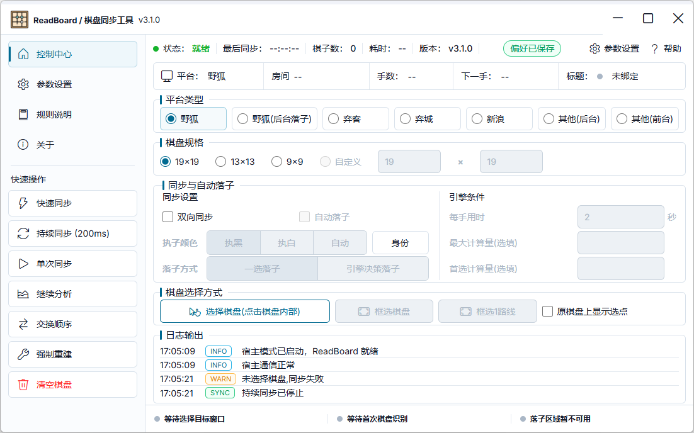
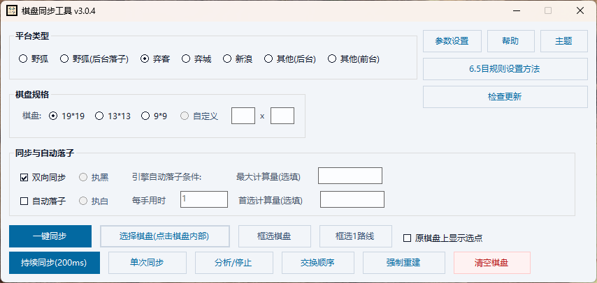

<div align="center">

# ReadBoard

Windows 棋盘同步工具，为 [LizzieYzy-Next](https://github.com/wimi321/lizzieyzy-next) 提供截图取棋、棋子识别、棋盘状态回传与模拟落子能力。

<p>
  
  
  
  
  
</p>

<a href="readme.md">简体中文</a> ｜
<a href="readme_en.md">English</a>



</div>

> [!IMPORTANT]
> **本项目可能已不再适配原版 [LizzieYzy](https://github.com/yzyray/lizzieyzy)。**
> 当前所有维护、协议演进与打包流程都围绕 [LizzieYzy-Next](https://github.com/wimi321/lizzieyzy-next) 进行，与原版 LizzieYzy 的兼容性不再保证。如果你使用的是原版 LizzieYzy，请使用其自带的 readboard，或切换到 LizzieYzy-Next。

## 概述

ReadBoard 通过截屏方式从外部围棋客户端窗口抓取棋盘画面，使用 OpenCV 颜色阈值识别棋子位置，并通过 TCP 或标准输入输出管道把棋盘状态实时同步给宿主程序（LizzieYzy-Next）。同时它也接收宿主下发的落子指令，通过模拟点击在客户端上完成自动落子。

## 功能

- 外部棋盘窗口截图捕获，含野狐 / 弈客平台的窗口绑定与标题解析
- OpenCV 棋子识别与棋盘状态实时回传宿主
- 接收宿主指令模拟落子，野狐支持后台落子（窗口不能最小化）
- 野狐身份识别：通过玩家列表与对局栏确定本方昵称和棋色
- 托管更新：检查 → 下载 → 校验，交由宿主完成安装替换
- 浅色 / 深色 / 跟随系统三种配色
- 多语言：简体中文 / English / 日本語 / 한국어

## 维护分支

本仓库维护两条发布线，更新检查根据当前 Windows 版本自动选择通道：

| 分支 | UI 框架 | 版本线 | 系统要求 |
| --- | --- | --- | --- |
| `main` | WebView2 | v3.1.x | Windows 10 version 1809 (build 17763)+ |
| `legacy/winforms` | WinForms | v3.0.x | 更早的 Windows 系统 |

> [!NOTE]
> 两条通道互不干扰。WebView2 主线不会整体合并回 `legacy/winforms`，旧系统用户仍可通过 legacy 通道获得选择性修复。

## 系统要求

- Windows 10 version 1809 (build 17763) 及以上，或 Windows 11
- [WebView2 Evergreen Runtime](https://developer.microsoft.com/en-us/microsoft-edge/webview2/)（系统共享；缺失时启动会提示安装）
- 官方发布包为 self-contained，无需另装 .NET Runtime；开发需要 .NET 10 SDK

## 使用

正常使用时 `readboard.exe` 由 LizzieYzy-Next 启动，通过 TCP 或命名管道与宿主通信。无参数启动不会显示窗口。

需要单独打开 UI 调试时，用脚本模拟宿主启动：

```powershell
pwsh.exe -NoProfile -ExecutionPolicy Bypass -File scripts/run-readboard-ui-debug.ps1
```

指定某个发布包里的 exe：

```powershell
pwsh.exe -NoProfile -ExecutionPolicy Bypass -File scripts/run-readboard-ui-debug.ps1 -ExePath "D:\path\to\readboard.exe"
```

## 开发

```powershell
dotnet restore readboard.sln --configfile NuGet.Config
dotnet build readboard.sln -c Debug
dotnet test tests/Readboard.VerificationTests/Readboard.VerificationTests.csproj --no-build
```

更多见 [docs/DEVELOPMENT.md](docs/DEVELOPMENT.md)。

## 打包

> [!TIP]
> 始终使用 `scripts/package-readboard-release.local.ps1`，不要手写 build / copy / compress 命令。默认 `-SkipZip` 只生成目录，需要分发时再生成 zip。

```powershell
# 仅生成 release 目录
pwsh.exe -NoProfile -ExecutionPolicy Bypass -File scripts/package-readboard-release.local.ps1 -SkipZip

# 生成发布用 zip
pwsh.exe -NoProfile -ExecutionPolicy Bypass -File scripts/package-readboard-release.local.ps1
```

## 与 LizzieYzy-Next 的关系

本项目是 LizzieYzy-Next 的外接同步工具，宿主侧启动逻辑位于：

```text
lizzieyzy-next/src/main/java/featurecat/lizzie/analysis/ReadBoard.java
```

涉及启动参数、协议文本、发布目录结构或打包内容的改动，需要同步检查 LizzieYzy-Next。

<details>
<summary>v3.0 WinForms 版本截图</summary>



</details>
